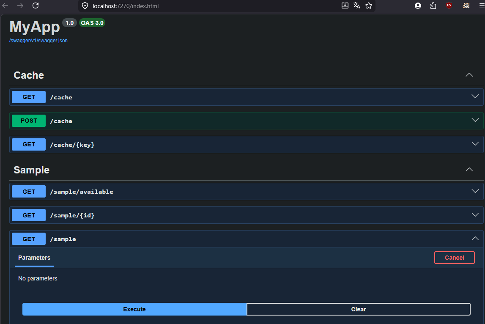
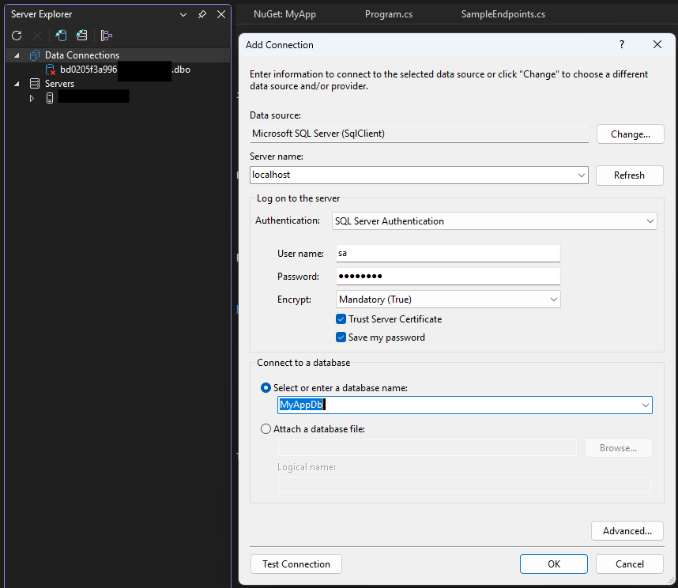

# Sample ASP .NET Core Architecture

Pattern [Domain-Driven Design](http://dddcommunity.org/) DDD

## 01 - Presentation

> The user interface layer

- [MyApp(.MinAPI)](./MyApp/MyApp/README.md) : Min API with SwaggerUI

## 02 - Domain

> The data management layer

- [Domain](./MyApp/MyApp.Domain/README.md)

## 03 - Data

> The data access layer 

- [Data](./MyApp/MyApp.Data/README.md)

## 04 - Infrastructure

> The app management layer

- [CrossCutting](./MyApp/MyApp.CrossCutting/README.md)

## Global

- The [Inversion Of Control](https://msdn.microsoft.com/en-us/library/ff921087.aspx).

## Installation

### Local DB

Install docker,
Then open a CLI :

> docker compose up -d

> dotnet tool install --global dotnet-ef

OR (if already installed) :

> dotnet tool update --global dotnet-ef

Then, 

> cd .\MyApp

Initial Migration for a fresh start.

> dotnet ef migrations add InitialCreate --project .\MyApp.Data\MyApp.Data.csproj --startup-project .\MyApp\MyApp.csproj

Create Database or Update :

> dotnet ef database update --project MyApp/MyApp.csproj

Use SQL Server Explorer :

